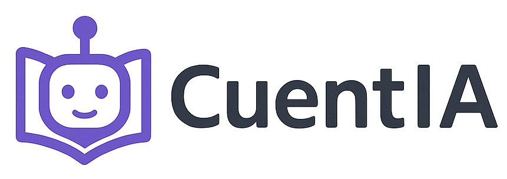

# Proyecto Final - CuentIA


## Integrantes Grupo 1
- Jostin Fernando Chalan Mora
- Aaron Alejandro Bayas Caicedo
- Mariana Katherine Reyes Arias

## Descripción
CuentIA, una plataforma digital basada en inteligencia artificial que genere cuentos infantiles personalizados según los datos ingresados por padres o educadores: nombre, edad, intereses, valores o temáticas educativas deseadas.
Esta plataforma integrará tecnologías de procesamiento de lenguaje natural (NLP) para
generar el texto narrativo, así como sistemas de texto a voz (TTS) para narrar los cuentos,
permitiendo así el acceso tanto en formato escrito como auditivo. Además, contará con
una biblioteca personal y herramientas de seguimiento lector.

---

## Modulos

Módulo 1: Gestión de Usuarios y Perfiles

Funcionalidad: Este módulo permite el acceso y administración del sistema, así como la
personalización del perfil del niño.
• Funciones:
o Registro y autenticación de usuarios (padres, educadores).
o Creación y configuración de perfiles personalizados.
o Edición de preferencias lectoras (temas, personajes, idioma, edad).


Módulo 2: Generación y Narración de Cuentos Personalizados
Funcionalidad: Este módulo permite la generación de cuentos únicos mediante IA y su
posterior narración por voz.
• Funciones:
o Entrada de datos del perfil del niño y parámetros del cuento.
o Generación automática de cuentos con IA (estructura narrativa,
vocabulario apropiado).
o Conversión del cuento generado a audio con tecnología TTS.
o Vista previa y controles de reproducción.


Módulo 3: Biblioteca Digital y Seguimiento Lector

Módulo 3: Biblioteca Digital y Seguimiento Lector
• Funcionalidad: Este módulo organiza y almacena los cuentos generados, además
de monitorear el desarrollo lector del niño.
• Funciones:
o Almacenamiento y organización de cuentos por perfil.
o Búsqueda, filtros y descarga de cuentos.
o Registro de cuentos leídos, duración de lectura o escucha.
o Generación de informes sobre hábitos y preferencias lectoras.


## Instrucciones de instalación y ejecución

1. Crear y activar entorno virtual:

```bash
python -m venv venv

# En Windows PowerShell
.\venv\Scripts\activate

# En Linux/macOS
source venv/bin/activate

#instalar dependencias 
pip install -r requirements.txt

#realizar migraciones 
python manage.py makemigrations
python manage.py migrate

#ejecutar servidor 
python manage.py runserver


